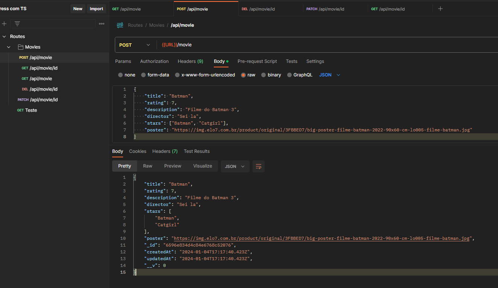
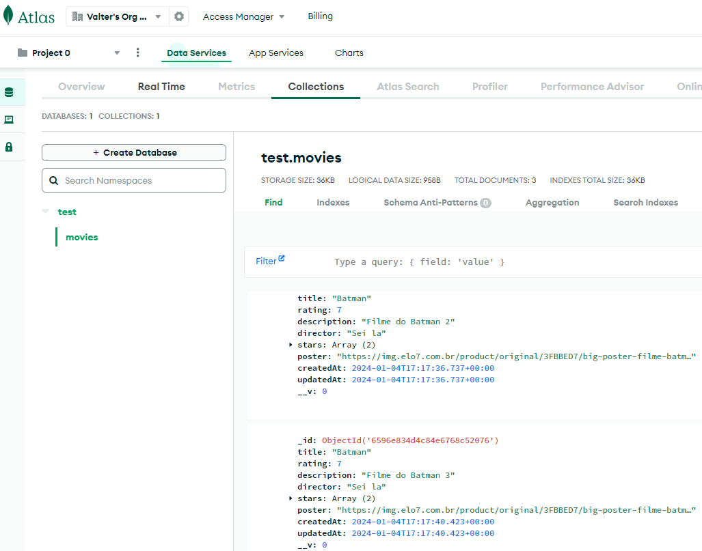
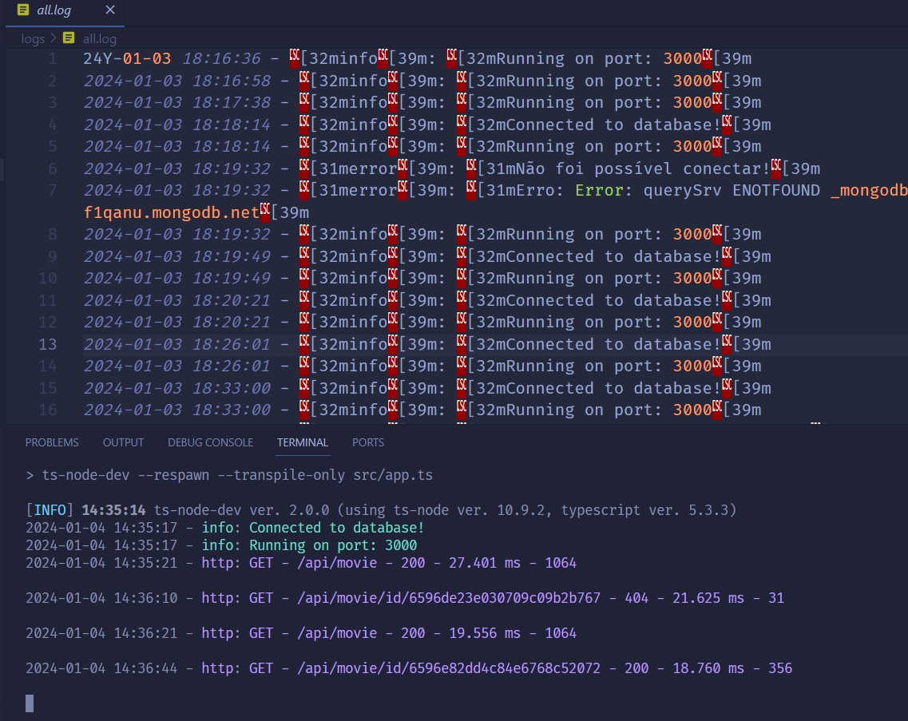

<h1 align="center">API RESTful com Typescript + Express</h1>

 🚀 Estudo de API com TypeScript

<h1 align="center"></h1>

•
 <a href="#objetivo">Objetivo</a> •
 <a href="#tecnologias">Tecnologias</a> • 
 <a href="#autor">Autor</a> •

<h1 align="center">
    
    
    
    
</h1>

## **Objetivo**

 🔍 Treinando como o TS se comporta com o Express, utilizando Mongodb como banco de dados, validações com express-validator e loggers com Morgan e Winston. 

## **Tecnologias**

<ul>⚙️ Backend    
    <li>🛠 Mongoose
    <li>🛠 MongoDB Atlas
    <li>🛠 Express | Express-validator
    <li>🛠 Morgan
    <li>🛠 Winston
    <li>🛠 Typescript
</ul>

## **Autor**

 Desenvolvido por <a href="https://github.com/valtercfjunior">Valter Junior</a> 

